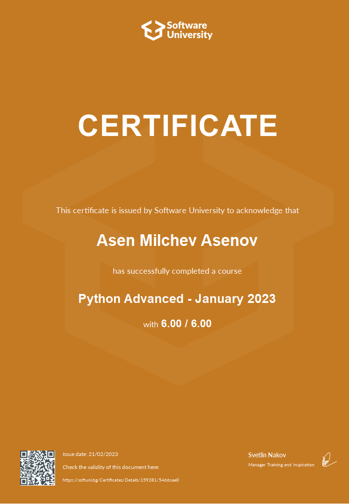

# SoftUni Programming Advanced & OOP January 2023
 
### This repository contains my solutions for the tasks from the SoftUni course Programming Advanced & OOP with Python-January-2023. 

### [Python Advanced Training Program](https://softuni.bg/trainings/3963/python-advanced-january-2023)
 ### &nbsp;&nbsp;&nbsp;&nbsp;&nbsp;&nbsp;• &nbsp;&nbsp;&nbsp;[Python Advanced Certificate Credentials](https://softuni.bg/certificates/details/159281/5466cae0)
 

### [Python OOP Training Program](https://softuni.bg/trainings/3964/python-oop-february-2023)

### Course details:
Course duration: 12 weeks 
Course start: 10.01.2023 
Course tutors:  
 &nbsp;&nbsp;&nbsp;• Python Labs: [Mario Zahariev](https://github.com/zahariev-webbersof) 
 &nbsp;&nbsp;&nbsp;• Python Exercises: [Diyan Kalaydzhiev](https://github.com/DiyanKalaydzhiev23) 
 

| Advanced | OOP |
| --- | --- |
|1. **Resources** |1. **Resources** |
|2. **Course Info** |2. **Course Info** |
|3. **Lists as Stacks and Queues** &nbsp;&nbsp;&nbsp;• Stacks (creating, adding and removing elements); &nbsp;&nbsp;&nbsp;• Queues (creating, adding and removing elements).|3. **First Steps in OOP** &nbsp;&nbsp;&nbsp;• Project Architecture; &nbsp;&nbsp;&nbsp;• Basic Concepts of OOP; &nbsp;&nbsp;&nbsp;• A First Look at Classes; &nbsp;&nbsp;&nbsp;• Scope and Namespace. |
|4. **Exercise: Lists as Stacks and Queues** |4. **Exercise: First Steps in OOP** |
|5. **Tuples and Sets** &nbsp;&nbsp;&nbsp;• Tuples (definition, usage, methods); &nbsp;&nbsp;&nbsp;• Sets (definition, operators, methods). |5. **Classes and Objects** &nbsp;&nbsp;&nbsp;• Class Objects; &nbsp;&nbsp;&nbsp;• Instance Objects; &nbsp;&nbsp;&nbsp;• Method Objects; &nbsp;&nbsp;&nbsp;• Class and Instance Variables. |
|6. **Exercise: Tuples and Sets** |6. **Exercise: Classes and Objects** |
|7. **Exercise: Stacks, Queues, Tuples and Sets** |7. **Inheritance** &nbsp;&nbsp;&nbsp;• Inheritance; &nbsp;&nbsp;&nbsp;• Forms of Inheritance; &nbsp;&nbsp;&nbsp;• Mixins. |
|8. **Multidimensional Lists** &nbsp;&nbsp;&nbsp;• Definition and Usage; &nbsp;&nbsp;&nbsp;• Creating Multidimensional Lists; &nbsp;&nbsp;&nbsp;• Traversing and Manipulation; &nbsp;&nbsp;&nbsp;• Other Nested Structures. |8. **Exercise: Inheritance** |
|9. **Exercise: Multidimensional Lists** |9. **Encapsulation** &nbsp;&nbsp;&nbsp;• Encapsulation Definition; &nbsp;&nbsp;&nbsp;• Access Modifiers in Python; &nbsp;&nbsp;&nbsp;• Getters and Setters. |
|10. **Exercise: Multidimensional Lists** |10. **Exercise: Encapsulation** |
|11. **Functions Advanced** &nbsp;&nbsp;&nbsp;• Packing Arguments; &nbsp;&nbsp;&nbsp;• Unpacking Arguments; &nbsp;&nbsp;&nbsp;• Recursion; &nbsp;&nbsp;&nbsp;• Decorators. |11. **Static and Class Methods** &nbsp;&nbsp;&nbsp;• Static Method; &nbsp;&nbsp;&nbsp;• Class Method; &nbsp;&nbsp;&nbsp;• Overriding a Class Method. |
|12. **Exercise: Functions Advanced** |12. **Exercise: Static and Class Methods** |
|13. **Error Handling** &nbsp;&nbsp;&nbsp;• Errors and Exceptions; &nbsp;&nbsp;&nbsp;• Common Error Types; &nbsp;&nbsp;&nbsp;• Custom Exceptions; &nbsp;&nbsp;&nbsp;• Catching Exceptions. |13. **Polymorphism and Abstraction** &nbsp;&nbsp;&nbsp;• What is Polymorphism?; &nbsp;&nbsp;&nbsp;• Overriding Magic Methods; &nbsp;&nbsp;&nbsp;• What is Abstraction?; &nbsp;&nbsp;&nbsp;• Abstract classes and methods; &nbsp;&nbsp;&nbsp;• Duck-typing. |
|14. **Exercise: Error Handling** |14. **Exercise: Polymorphism and Abstraction** |
|15. **File Handling** &nbsp;&nbsp;&nbsp;• Python File Object; &nbsp;&nbsp;&nbsp;• Opening a File; &nbsp;&nbsp;&nbsp;• Reading File; &nbsp;&nbsp;&nbsp;• Writing and Creating a File; &nbsp;&nbsp;&nbsp;• Deleting a File. |15. **SOLID** &nbsp;&nbsp;&nbsp;• Single Resposibility; &nbsp;&nbsp;&nbsp;• Open/Closed; &nbsp;&nbsp;&nbsp;• Liskov Substitution; &nbsp;&nbsp;&nbsp;• Iterface Sugregation; &nbsp;&nbsp;&nbsp;• Dependency Inversion. |
|16. **Exercise: File Handling** |16. **Exercise: SOLID** |
|17. **Workshop** |17. **Iterators and Generators** &nbsp;&nbsp;&nbsp;• What are Iterators?; &nbsp;&nbsp;&nbsp;• What are Generators? (the yield statement). |
|18. **Exercise: Workshop** |18. **Exercise: Iterators and Generators** |
|19. **Modules** &nbsp;&nbsp;&nbsp;• Module Definition; &nbsp;&nbsp;&nbsp;• Build-in Modules; &nbsp;&nbsp;&nbsp;• External Modules (PIP); &nbsp;&nbsp;&nbsp;• Custom Modules. |19. **Decorators** &nbsp;&nbsp;&nbsp;• Functions Returning Functions; &nbsp;&nbsp;&nbsp;• Decorators; &nbsp;&nbsp;&nbsp;• Accepting Arguments in Decorators; &nbsp;&nbsp;&nbsp;• Passing Arguments to Decorators; &nbsp;&nbsp;&nbsp;• Class Decorators. |
|20. **Exercise: Modules** |20. **Exercise: Decorators** |
|21. **Exam Preparation** |21. **Testing** &nbsp;&nbsp;&nbsp;• What is Unit Testing?; &nbsp;&nbsp;&nbsp;• Unit Testing Basics; &nbsp;&nbsp;&nbsp;• Unit Testing Framework - unittest; &nbsp;&nbsp;&nbsp;• Mocking. |
|22. **Exam Preparation** |22. **Exercise: Testing** |
|23. **Regular Exam** |23. **Design Patterns** &nbsp;&nbsp;&nbsp;• Design Patterns; &nbsp;&nbsp;&nbsp;• Definition of Design Patterns; &nbsp;&nbsp;&nbsp;• Benefits and Drawbacks; &nbsp;&nbsp;&nbsp;• Types of Design Patterns. |
|24. **Retake Exam** |24. **Exam Preparation** |
||25. **Exam Preparation** |
||26. **Workshop** |
||27. **Workshop** |
||28. **Regular Exam** |
||29. **Retake Exam** |
